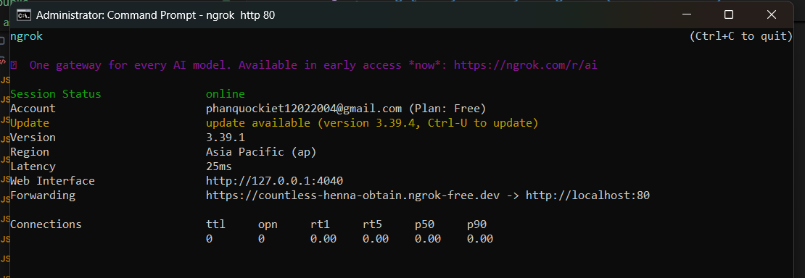

# 👟 Hệ Thống Quản Lý Kho Giày Thông Minh (Smart Warehouse)
**Đồ án Khóa luận tốt nghiệp - Đại học Công nghiệp TP.HCM (IUH)**

Hệ thống quản lý kho giày tích hợp trí tuệ nhân tạo (AI) chạy **Offline 100%**, hỗ trợ nhận diện sản phẩm qua hình ảnh và trợ lý ảo Chatbot truy vấn dữ liệu tồn kho thông minh bằng ngôn ngữ tự nhiên.

---

## 🛠 1. Công nghệ & Thư viện sử dụng
* **Frontend:** Bootstrap 5, CSS3, JavaScript.
* **Backend:** PHP (Kiến trúc MVC), Python
* **Database:** PostgreSQL + Extension `pgvector`.
* **AI:** MODEL CLIP VISION ViT-B/32 (OPENAI)

---

## 📂 2. Cấu trúc thư mục dự án
```text
D:\Application\xampp\htdocs\Shoe_Warehouse
│   .env                # Cấu hình biến môi trường
│   .gitignore          # Các file loại trừ khi git
│   README.md           # Hướng dẫn dự án
│   testapi.php         # File test API
│   testhash.php        # File test mã hóa mật khẩu
│
├───ai_services         # Dịch vụ AI (Python)
│   │   ai_bridge.py        # API Chatbot (Cổng 8000)
│   │   api_vector.py       # API Quét ảnh (Cổng 5000)
│   │   generate_vector.py  # Script khởi tạo/Tải model lần đầu
│   │   VisionService.php   # Cầu nối gọi Python từ PHP
│   └───models/             # Lưu trữ bộ não AI (CLIP Model)
│
├───app                 # Source code PHP chính (MVC)
│   ├───controllers/    # Auth, Category, Product, Report, User Controllers
│   ├───models/         # Category, Product, Report, User Models
│   └───views/          # layouts (footer, header, sidebar...) & pages
│
├───config              # database.php (Cấu hình kết nối)
├───csdl                # backup.sql (File sao lưu dữ liệu)
└───public              # Thư mục thực thi chính
    │   index.php
    └───assets/         # Tài nguyên hệ thống
        ├───css/        # Các file định dạng giao diện (.css)
        ├───img_logo/   # Logo các thương hiệu giày
        ├───img_product/# Hình ảnh sản phẩm trong kho
        ├───img_temp/   # Ảnh tạm thời khi xử lý AI


- Cài đặt thư viện CLIP trực tiếp từ source OpenAI:
python -m pip install git+https://github.com/openai/CLIP.git

- Đối với Quét ảnh:
Chạy file generate_vector.py để AI tự động tải bộ não CLIP về thư mục models (Chỉ chạy 1 lần duy nhất):
cd ai_services
python generate_vector.py


🔹 Bước 3: Cấu hình Database
Mở PostgreSQL, tạo database tên là shoe_warehouse_ai.

Import file csdl/backup.sql vào database vừa tạo.

Kích hoạt extension vector: CREATE EXTENSION IF NOT EXISTS vector;

Cấu hình User/Password database trong config/database.php.


4. Cách vận hành khi Demo (Bắt buộc)
Để hệ thống hoạt động đầy đủ tính năng, bồ cần mở cửa sổ Terminal để chạy các dịch vụ sau:


5. composer install (tải vendor của composer dùng pusher bắn tín hiệu)


**HÀM REMOVE GIÀY KHỎI LAYOUT KỆ, CHẠY TRONG QUERY TOOL**
DO $$
DECLARE
    r RECORD;
    t_key TEXT;
    s_key TEXT;
    new_layout JSONB;
BEGIN
    FOR r IN SELECT shelf_id, layout FROM shelves LOOP
        new_layout := r.layout;
        -- Duyệt qua từng tầng (tier keys) trong kệ
        FOR t_key IN SELECT jsonb_object_keys(r.layout) LOOP
            -- Duyệt qua từng ô kệ (slot keys) trong tầng đó
            FOR s_key IN SELECT jsonb_object_keys(r.layout->t_key) LOOP
                -- Reset danh sách giày trong ô về mảng rỗng []
                new_layout := jsonb_set(new_layout, ARRAY[t_key, s_key], '[]'::jsonb);
            END LOOP;
        END LOOP;
        
        -- Cập nhật lại layout đã xóa sạch giày vào CSDL
        UPDATE shelves SET layout = new_layout WHERE shelf_id = r.shelf_id;
    END LOOP;
    
    RAISE NOTICE 'Da xoa toan bo giay tren cac ke thanh cong!';
END $$;


**HÀM IMPORT GIÀY VÀO KỆ, CHẠY TRONG QUERY TOOL**

DO $$
DECLARE
    v_tier_priority INT[] := ARRAY[2, 1, 3, 4]; -- Ưu tiên tầng: Tầm tay (2) -> Hông (1) -> Mắt (3) -> Leo tầng (4)
    v_shelves TEXT[] := ARRAY['A', 'B', 'C', 'D', 'E', 'F'];

    v_vid INT;
    v_shelf_name TEXT;
    v_layout JSONB;
    v_t INT;
    v_s INT;
    v_has_more BOOLEAN;
    v_top_brand_ids INT[];
BEGIN
    -- 1. RESET KHO
    UPDATE shelves SET layout = '{
        "1":{"01":[],"02":[],"03":[],"04":[],"05":[],"06":[]},
        "2":{"01":[],"02":[],"03":[],"04":[],"05":[],"06":[]},
        "3":{"01":[],"02":[],"03":[],"04":[],"05":[],"06":[]},
        "4":{"01":[],"02":[],"03":[],"04":[],"05":[],"06":[]}
    }'::jsonb;

    -- 2. XÁC ĐỊNH CHÍNH XÁC TOP 2 BRAND (SỬA LỖI JOIN)
    SELECT ARRAY_AGG(category_id) INTO v_top_brand_ids
    FROM (
        SELECT p.category_id, SUM(COALESCE(t.quantity, 0)) as vol
        FROM categories c
        JOIN products p ON c.category_id = p.category_id
        JOIN product_variants pv ON p.product_id = pv.product_id
        LEFT JOIN transactions t ON pv.variant_id = t.variant_id
        GROUP BY p.category_id
        ORDER BY vol DESC LIMIT 2
    ) sub;

    -- 3. TẠO 2 HÀNG ĐỢI (QUEUES)
    -- Queue 1: Top 2 Brand (Nike, Vans) - Gom theo brand, mẫu Hot đứng trước
    CREATE TEMP TABLE queue_top AS
    SELECT pv.variant_id
    FROM product_variants pv
    JOIN products p ON pv.product_id = p.product_id
    LEFT JOIN (SELECT variant_id, SUM(quantity) as v_vol FROM transactions GROUP BY 1) va ON pv.variant_id = va.variant_id
    CROSS JOIN generate_series(1, pv.stock)
    WHERE p.category_id = ANY(v_top_brand_ids) AND pv.is_deleted = false AND pv.stock > 0
    ORDER BY p.category_id, va.v_vol DESC;

    -- Queue 2: Các hãng còn lại - Gom theo brand, mẫu Hot đứng trước
    CREATE TEMP TABLE queue_others AS
    SELECT pv.variant_id
    FROM product_variants pv
    JOIN products p ON pv.product_id = p.product_id
    LEFT JOIN (SELECT variant_id, SUM(quantity) as v_vol FROM transactions GROUP BY 1) va ON pv.variant_id = va.variant_id
    CROSS JOIN generate_series(1, pv.stock)
    WHERE p.category_id != ALL(v_top_brand_ids) AND pv.is_deleted = false AND pv.stock > 0
    ORDER BY p.category_id, va.v_vol DESC;

    -- BƯỚC 4: ĐỔ TOP 2 BRAND THEO CHIỀU DỌC (VERTICAL) - ĐIỀN ĐẦY TỪNG KỆ
    DECLARE
        hot_cursor CURSOR FOR SELECT variant_id FROM queue_top;
    BEGIN
        OPEN hot_cursor;
        v_has_more := TRUE;
        FOREACH v_shelf_name IN ARRAY v_shelves LOOP
            IF NOT v_has_more THEN EXIT; END IF;
            SELECT layout INTO v_layout FROM shelves WHERE shelf_name = v_shelf_name;

            -- Điền đầy kệ hiện tại (Tầng 2->1->3->4) trước khi sang kệ mới
            FOREACH v_t IN ARRAY v_tier_priority LOOP
                FOR v_s IN 1..6 LOOP
                    FOR i IN 1..4 LOOP
                        FETCH hot_cursor INTO v_vid;
                        IF NOT FOUND THEN v_has_more := FALSE; EXIT; END IF;
                        v_layout := jsonb_set(v_layout, ARRAY[v_t::text, LPAD(v_s::text, 2, '0')], (v_layout->v_t::text->LPAD(v_s::text, 2, '0')) || to_jsonb(v_vid));
                    END LOOP;
                    IF NOT v_has_more THEN EXIT; END IF;
                END LOOP;
                IF NOT v_has_more THEN EXIT; END IF;
            END LOOP;
            UPDATE shelves SET layout = v_layout WHERE shelf_name = v_shelf_name;
        END LOOP;
        CLOSE hot_cursor;
    END;

    -- BƯỚC 5: ĐỔ CÁC HÃNG CÒN LẠI THEO CHIỀU NGANG (HORIZONTAL SPREADING)
    -- Chỉ dàn đều vào các ô còn trống
    DECLARE
        others_cursor CURSOR FOR SELECT variant_id FROM queue_others;
    BEGIN
        OPEN others_cursor;
        v_has_more := TRUE;
        -- Ưu tiên Tầng 2 cho toàn kho, sau đó đến tầng 1...
        FOREACH v_t IN ARRAY v_tier_priority LOOP
            FOREACH v_shelf_name IN ARRAY v_shelves LOOP
                SELECT layout INTO v_layout FROM shelves WHERE shelf_name = v_shelf_name;

                FOR v_s IN 1..6 LOOP
                    -- Điền nốt chỗ trống (max 4 đôi/ô)
                    WHILE jsonb_array_length(v_layout->v_t::text->LPAD(v_s::text, 2, '0')) < 4 LOOP
                        FETCH others_cursor INTO v_vid;
                        IF NOT FOUND THEN 
                            UPDATE shelves SET layout = v_layout WHERE shelf_name = v_shelf_name;
                            v_has_more := FALSE;
                            EXIT; 
                        END IF;
                        v_layout := jsonb_set(v_layout, ARRAY[v_t::text, LPAD(v_s::text, 2, '0')], (v_layout->v_t::text->LPAD(v_s::text, 2, '0')) || to_jsonb(v_vid));
                    END LOOP;
                    IF NOT v_has_more THEN EXIT; END IF;
                END LOOP;
                UPDATE shelves SET layout = v_layout WHERE shelf_name = v_shelf_name;
                IF NOT v_has_more THEN EXIT; END IF;
            END LOOP;
            IF NOT v_has_more THEN EXIT; END IF;
        END LOOP;
        CLOSE others_cursor;
    END;

    DROP TABLE queue_top;
    DROP TABLE queue_others;
    RAISE NOTICE 'Hoàn tất! Top 2 Brand đã lấp đầy kệ đầu, Others dàn đều kệ cuối.';
END $$;


# app_id = "2150978"
# key = "24a79cb74cfa666e1831"
# secret = "4cb0f10dc4e59d30d062"
# cluster = "ap1"


Bước 1: Tải Ngrok
Bồ truy cập vào link này: ngrok.com/download

Chọn bản Windows (thường là Windows 64-bit).

Nó sẽ tải về một file .zip.

Bước 2: Giải nén và Cài đặt "toàn cầu"
Sau khi tải về, bồ giải nén ra sẽ thấy file ngrok.exe.

Copy file ngrok.exe.

Mở thư mục C:\Windows.

Dán (Paste) file đó vào đây.

Lợi ích: Làm cách này có thể đứng ở bất cứ thư mục dự án nào (như Shoe_Warehouse hay ai_services) gõ lệnh ngrok là nó chạy luôn, không cần phải cd đi đâu cả.

Bước 3: Lấy Authtoken (Dấu vân tay định danh)
Đăng nhập vào trang dashboard.ngrok.com.

Ở menu bên trái, chọn Your Authtoken.

Copy cái dãy mã dài dằng dặc đó.

Bước 4: Kích hoạt Ngrok trên máy
Mở CMD (hoặc PowerShell) lên và gõ lệnh sau: ngrok http 80 (tùy port xampp đang dùng)

